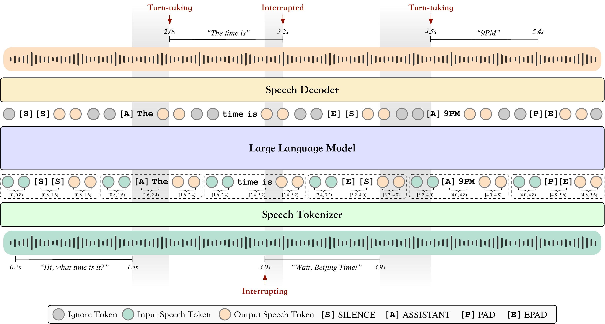

# BayLing-Duplex

Qingkai Fang, Shoutao Guo, Yang Feng

[](https://github.com/BayLing-Models/BayLing-Duplex)
[](https://huggingface.co/BayLing-Models/BayLing-Duplex)
[](https://arxiv.org/abs/2606.14528)

**BayLing-Duplex: Native Full-Duplex Speech Dialogue with a Single Autoregressive LLM**

BayLing-Duplex is a native full-duplex speech dialogue model. It listens and speaks at the same time, decides when to start responding, and stops when interrupted, without an external VAD or a separate turn-taking controller.

<p align="center">
  
</p>

## Overview

BayLing-Duplex represents user speech, assistant text, and assistant speech as a single multi-channel interleaved autoregressive sequence. Turn-taking, interruption handling, text planning, and speech-token generation are all expressed as next-token prediction.

The text channel carries dialogue-state tokens such as `[SILENCE]`, `<|assistant|>`, `[PAD]`, and `[EPAD]`, so no extra classifier head, VAD, scheduler, or finite-state turn-taking controller is required at inference time.

## Highlights

- Native full-duplex speech dialogue: the model can listen while speaking.
- Single autoregressive decoding path for timing decisions, text, and speech tokens.
- Block-wise multi-channel interleaving that preserves contiguous assistant text.

## Model Weights

Download the BayLing-Duplex checkpoint together with the GLM-4-Voice speech tokenizer and decoder:

```bash
pip install -U huggingface_hub

# Run this first if the BayLing-Duplex model repository is still private.
hf auth login

mkdir -p models
hf download BayLing-Models/BayLing-Duplex \
  --repo-type model \
  --local-dir models/bayling_duplex_model
hf download zai-org/glm-4-voice-tokenizer \
  --repo-type model \
  --local-dir models/speech_tokenizer
hf download zai-org/glm-4-voice-decoder \
  --repo-type model \
  --local-dir models/speech_decoder
```

After downloading, the local layout should be:

```text
models/
  bayling_duplex_model/
    config.json
    configuration_chatglm.py
    modeling_chatglm.py
    tokenization_chatglm.py
    tokenizer.model
    tokenizer_config.json
    special_tokens_map.json
    added_tokens.json
    model.safetensors.index.json
    model-00001-of-0000N.safetensors
    ...
  speech_tokenizer/
    config.json
    preprocessor_config.json
    model.safetensors
  speech_decoder/
    config.yaml
    flow.pt
    hift.pt
```

## Installation

Use Python 3.10+ and a PyTorch build matching your CUDA runtime.

```bash
pip install -r requirements.txt
pip install -e .
```

For CPU-only smoke tests, the code works with `--device cpu`, but real-time full-duplex use should run on GPU.

## Quick Start

```bash
python -m bayling_duplex.cli \
  --model-path models/bayling_duplex_model \
  --speech-tokenizer-path models/speech_tokenizer \
  --decoder-path models/speech_decoder \
  --input-audio examples/input.wav \
  --output-json outputs/result.json \
  --output-audio outputs/response.wav \
  --interleave-ratio 10:5:10 \
  --max-duration 60 \
  --temperature 0.8 \
  --top-p 0.8
```

For a simple interruption or composite-audio test, ask decoding to continue until the second `[EPAD]`:

```bash
python -m bayling_duplex.cli \
  --model-path models/bayling_duplex_model \
  --speech-tokenizer-path models/speech_tokenizer \
  --decoder-path models/speech_decoder \
  --input-audio examples/interruption.wav \
  --output-json outputs/interruption.json \
  --output-audio outputs/interruption_assistant.wav \
  --max-epad-count 2 \
  --synthesize all
```

## Python API

```python
from bayling_duplex import BayLingDuplex

model = BayLingDuplex(
    model_path="models/bayling_duplex_model",
    speech_tokenizer_path="models/speech_tokenizer",
    decoder_path="models/speech_decoder",
    interleave_ratio="10:5:10",
    device="cuda",
)

result = model.generate(
    "examples/input.wav",
    max_duration=60.0,
    temperature=0.8,
    top_p=0.8,
)

print(result.text)
model.save_audio(result.response_audio_tokens, "outputs/response.wav")
result.save_json("outputs/result.json")
```

## Acknowledgements

BayLing-Duplex is trained based on GLM-4-Voice and uses components released by the GLM-4-Voice team. We thank the GLM-4-Voice team for making their model and code available to the community.

## License

See [LICENSE](LICENSE) and [NOTICE.md](NOTICE.md).

## Citation

```bibtex
@misc{fang2026baylingduplexnativefullduplexspeech,
  title         = {BayLing-Duplex: Native Full-Duplex Speech Dialogue with a Single Autoregressive LLM},
  author        = {Qingkai Fang and Shoutao Guo and Yang Feng},
  year          = {2026},
  eprint        = {2606.14528},
  archivePrefix = {arXiv},
  primaryClass  = {cs.CL},
  url           = {https://arxiv.org/abs/2606.14528}
}
```
